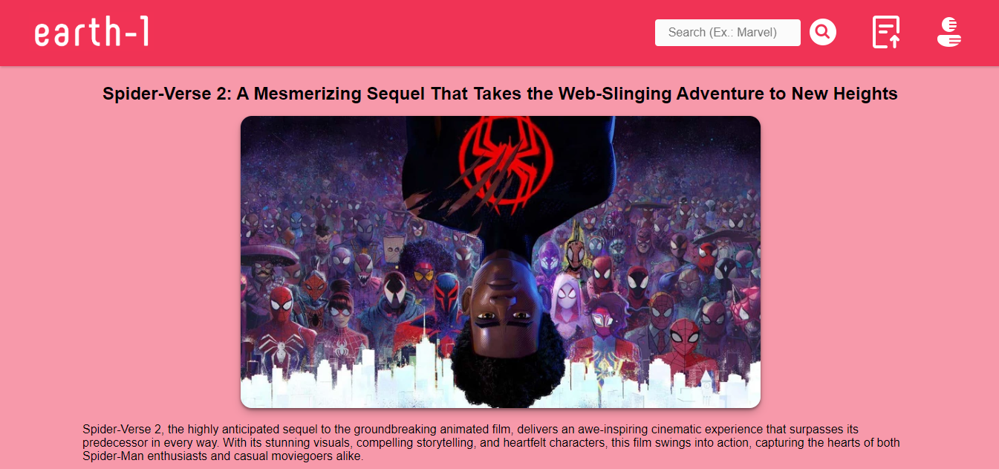

    
    <h1>Earth-1</h1>
    
A Social Web Platform to Publish and Read Comics Articles

## Open Source Code
- [API](https://github.com/pedrjose/earth-1): You can check the JavaScript code;
- [SPA](https://github.com/pedrjose/earth1-spa): You can check the React code.

  
  
  

## Features
- Create a profile;
- Publish articles;
- Like and comment on articles;
- Interact with other users.

## Device Compatibility
- iPad (1024x768);
- Laptop (1440x900);
- Desktop (1680x1050);
- Desktop (1920x1080);
- Desktop (2560x1440).

  
  
  

## Prerequisites
- Network access;
- Installed browser;
- Minimum screen width of 1024.
